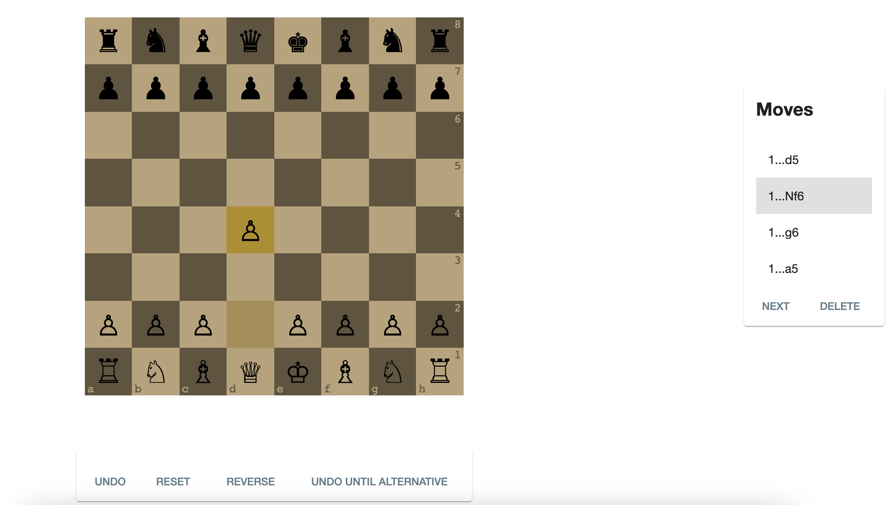
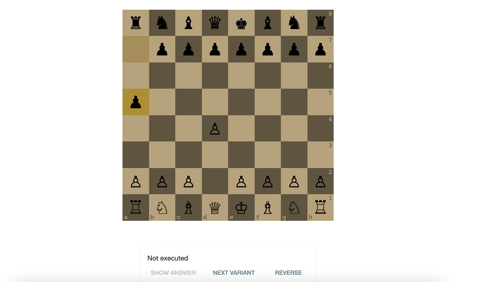

# chess-trainer
This project is a web page which helps the user to practice his chess openings.

## Prerequisites
Java 17 installed, maven installed, angular installed. 
## Setup
0. Run an empty postgresql database on localhost:5432/chesstrainer
1. Run the server on the backend folder.      
  1.1. Use mvn clean install.    
  1.2. Use javac on BackendApplication.java.      
  1.3. Use java BackendApplication.     
2. Run the front-end on the chess-trainer folder.        
  2.1. Use yarn install.  
  2.2. Use yarn start. 
3. Go to localhost:4200. 
